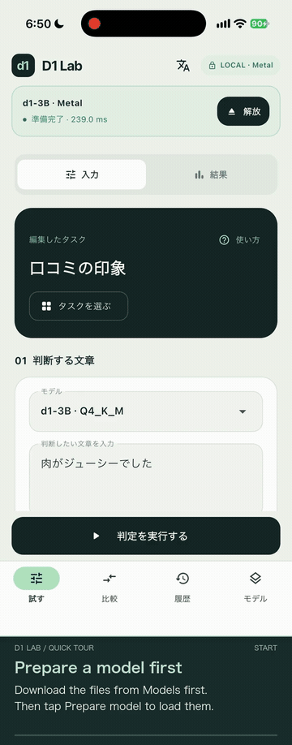

# D1 Lab

Try Liquid AI's **d1-3B / d1-omni-600M** on your iPhone or Apple Silicon Mac. Evaluate text, photos and recordings, inspect answer probabilities, and measure processing time. iOS inference runs locally with Metal.

[日本語](../README.md) · [Quick start](quickstart.en.md) · [Build instructions](building.en.md) · [Privacy](privacy.en.md)

Follow the [build instructions](building.en.md) to prepare the app. Once it is running, start with the samples below.

## Quick tour

[Watch with English captions (MP4, about 36 seconds)](videos/d1-lab-quick-tour-en.mp4) · [Japanese captions](videos/d1-lab-quick-tour-ja.mp4)

Show the animated preview

English captions guide you through the Japanese iPhone interface: choosing a task, running a text decision, reading timing, editing criteria, saving a task, photo/audio controls, comparison, history and model management. Models are already downloaded and prepared. Follow the [quick start](quickstart.en.md) for first-time setup.

## Your first decision

1. Open **Choose a task** and select **Review sentiment** from the English samples.
2. Select **d1-3B**.
3. Tap **Download a model to start**, then **Download files for this task**.
4. Return to **Try** and tap **Run decision**.
5. Read the selected answer and probabilities for Positive, Negative and Neutral.
6. Change the text to a negative review and run it again.

A task combines the material to evaluate, a natural-language instruction, and answer options or rating levels. Samples fill these in for you. Open the criteria card to edit the instruction and options.

## Photos and recordings

**Photo:** Open **Choose a task** → **Images** → **Main photo color**. Tap **Take a photo** or **Choose photo**, attach one photo, download the required model files, then tap **Run decision**. Other samples include **Classify the subject**, **Document type** and **Is there a cup?**

**Recording:** Open **Choose a task** → **Audio** → **Voice controls**. The app selects d1-omni. Tap **Record audio**, speak, then **Stop and use** → **Run decision**. Recordings are limited to 30 seconds.

Photo and audio tasks can run with **Additional context** left empty. Keep the instruction and answer options in the task; you do not need to type a transcript. Omni's audio capabilities were trained on English speech, so evaluate Japanese recordings for your use case. The model returns decisions rather than free-form conversation or transcripts.

Image and audio tasks need an additional projector file. **Download files for this task** downloads the required files together. Use one photo or one recording per run. The OS requests permission when you first use the camera or microphone.

On Mac, attach images with **Choose photo** or **Import from a file**. Use an iPhone to try camera capture.

Use **Image long edge** in the photo card to choose 256, 512, 768, 1024, 1536 or 2048 px (default: 2048 px). Aspect ratio and orientation are preserved; smaller images are not enlarged. The displayed width and height describe the image passed to evaluation. Changing the size after attachment regenerates it from the source, avoiding repeated downsampling. The source is also stored on your device and uses additional storage. Images in previous history records are kept unchanged. Compare Total, media processing time and input tokens across sizes. Image preparation and resizing time are separate from the decision’s Total.

## Reading results

| Metric | Meaning |
| --- | --- |
| Choice | Probabilities for the specified options and the selected answer |
| Noul | Probability of Yes; a value near 0.5 indicates uncertainty |
| Score | Expected rating, with levels numbered 0, 1, 2… from low to high |
| Total | This run’s file checks, any loading and unloading, evaluation and the app bridge |
| Prefill tok/s (3B) | Processed input tokens divided by main-model computation time |
| Input speed (omni) | Throughput of the bidirectional encoder and decision head |

**Measurement breakdown** separates loading, media encoding and model computation. Token throughput excludes loading and media encoding. Total excludes taking photos, recording, saving history and rendering the screen. Results show **Includes model loading** or **Reusing the loaded model**.

Use **Prepare model** at the top of the screen to load the selected model before entering inputs. Image and audio tasks also prepare their projector. The status changes to **Ready** and shows preparation time. Even the first decision then reuses the loaded model. Preparation time is separate from the decision’s Total. **Unload** releases memory while keeping downloaded files. Using **Prepare model** enables keeping the model loaded.

Normal runs keep one model loaded. Rerunning with the same model, backend, input limit and projector skips reloading. Inputs are processed every time, including after text or criteria changes. Keeping a model loaded uses memory; it is released when you leave the app or the OS reports memory pressure. Turn off **Keep the model ready** in **Advanced settings** to load and unload every run.

**Compare** sends the same input to both models sequentially, loading and unloading each one afresh. OS and Metal caches are not reset, so this is not a controlled cold-start benchmark. Check each model's answer, probabilities and processing speed. Audio is supported by omni only.

## Models and storage

Model files are downloaded from Hugging Face inside the app. They are not bundled with the app. Downloads can resume, and files are verified before use.

**Downloaded** means the model files are stored on your device. Tap **Prepare model** at the top; **Ready** means the model has loaded for evaluation. If loading fails, update the app and try preparing again.

Downloads use a pinned official release and check its size and SHA-256. Supported earlier releases already on your device remain usable after an app update. If the release changes, partial files from the earlier release restart from the beginning.

If a download fails with HTTP 403, update the app and retry. If it still fails, try again later or download the GGUF with the quantization listed below from the official repositories, then use **Import a file** in **Models**. Image and audio tasks also need the matching projector file. Imports are checked for size and SHA-256 too.

| Model | Main model | Additional media data | Inputs |
| --- | --- | --- | --- |
| d1-3B (Q4_K_M) | About 1.67 GB | About 583 MB (Q8_0) | Text, images |
| d1-omni-600M (Q8_0) | About 407 MB | About 263 MB (Q8_0) | Text, images, audio |

Sizes use decimal units. Allow extra free space for downloads and imports. **Models** shows occupied storage. **Delete model files** removes the selected model, projector and partial downloads. Download them again when needed. Model deletion keeps saved tasks and history.

Inference inputs are not sent to a server. Photos, recordings and run history are saved on your device. Deleting a history entry also removes media unused by other history or the current input. Open **Models → Saved data** to remove unused media or all history, photos and recordings. Models and saved tasks are kept. Your original photos and source files are unchanged. See the [privacy policy](privacy.en.md) for details.

## Language and saved tasks

Use the translation icon to choose System, Japanese or English. This changes the interface without rewriting your input, attachments or previous results. Choose the sample language separately in the task picker.

Enter a **Task name** below the decision criteria and choose **Automatic**, **Text**, **Images** or **Audio** in **Category**. The default, Automatic, uses the attachment type or the selected task's type. Tap **Save these criteria as a task**, then find it in **Choose a task** → the matching category → **My tasks** to reuse your input and criteria. Saved photo and audio tasks require a new attachment each time. Audio tasks select omni.

## Supported devices

iOS 16 or later, or macOS 14 or later on Apple Silicon. Speed and memory use depend on your device, input and settings. Android inference is not supported yet.

d1-omni is experimental. Sample answers are not guaranteed. Change the instructions and options to evaluate accuracy for your own use case.

## Licenses

The app source is Apache-2.0; llama.cpp is MIT. Dependency notices are available in the app’s license screen and in [Third-party notices](../THIRD_PARTY_NOTICES.md).

Models are governed separately by the [LFM Open License](https://www.liquid.ai/lfm-license). Commercial use has a company annual-revenue threshold of US$10 million. Companies meeting this threshold should confirm commercial licensing with Liquid AI. Downloading models separately does not remove their licensing conditions. See the [bundled original license](../assets/licenses/LFM-Open-License-1.0.txt).

This is not an official Liquid AI app.

Sources: [d1-3B GGUF](https://huggingface.co/LiquidAI/d1-3B-GGUF) · [d1-omni GGUF](https://huggingface.co/LiquidAI/d1-omni-600M-GGUF) · [llama.cpp](https://github.com/ggml-org/llama.cpp)
