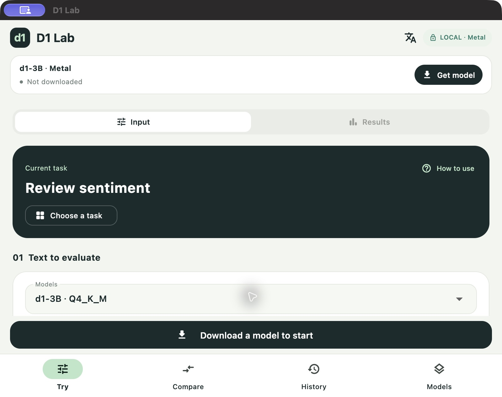
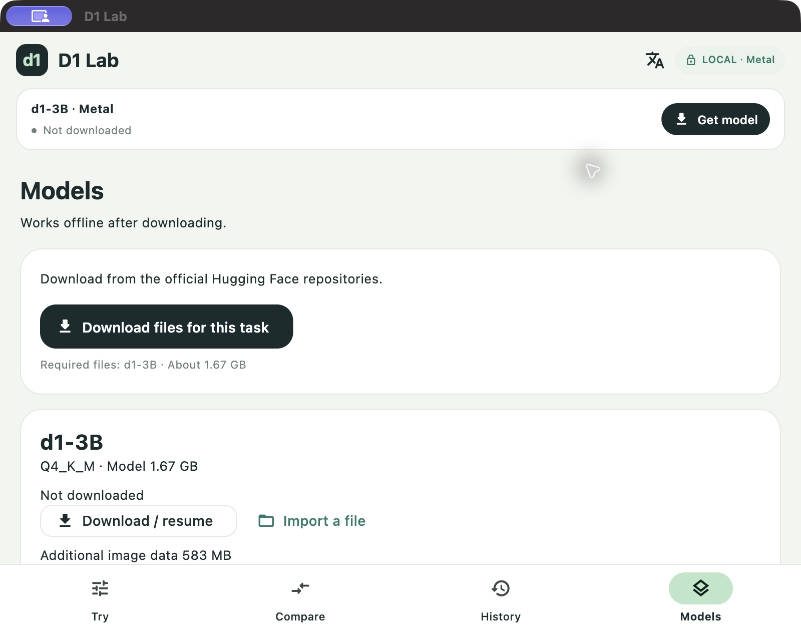

# Try your first decision

[日本語](quickstart.md) · [Build instructions](building.en.md) · [Full guide](README.en.md)

The screenshots show the Mac app. Follow the same steps on iPhone.

The [36-second iPhone tour with English captions](videos/d1-lab-quick-tour-en.mp4) also explains the workflow, results and timing. It uses the Japanese interface with models already prepared.

## 1. Choose a task

Open Try → Choose a task → English → Review sentiment. The sample fills in text, instructions and answer options. Start with the sample unchanged.

## 2. Download the model

Tap Download a model to start → Download files for this task. This text sample downloads the d1-3B model, about 1.67 GB. You need a network connection and enough free storage.

## 3. Run and change the text

After downloading, return to Try and tap Run decision. Inspect the selected answer and each option's probability. Change the text to a negative review and run again to compare answers.

Inspect Total and Decision to compare processing time. Prepare model loads the model before you run; repeated decisions reuse it. Prefill tok/s measures input processing and excludes taking photos, recording and loading the model.

## Try next

- Photo: select Images → Main photo color. Take or choose a photo, then run.
- Recording: select Audio → Voice controls and record audio. The app selects omni. Try English requests such as “Play music” and “Stop the music” first, and evaluate whether its answers are correct.
- Your own task: edit the text, instruction and options, enter a task name and save. You can leave Category set to Automatic.

Download the additional data required for photo or audio tasks. Additional context can be empty. After downloading models, decisions run offline.

## Delete saved data

Open Models → Saved data to remove unused media or all history, photos and recordings. Delete models from Models and saved tasks from the task list. The [privacy policy](privacy.en.md) is also readable inside the app.
