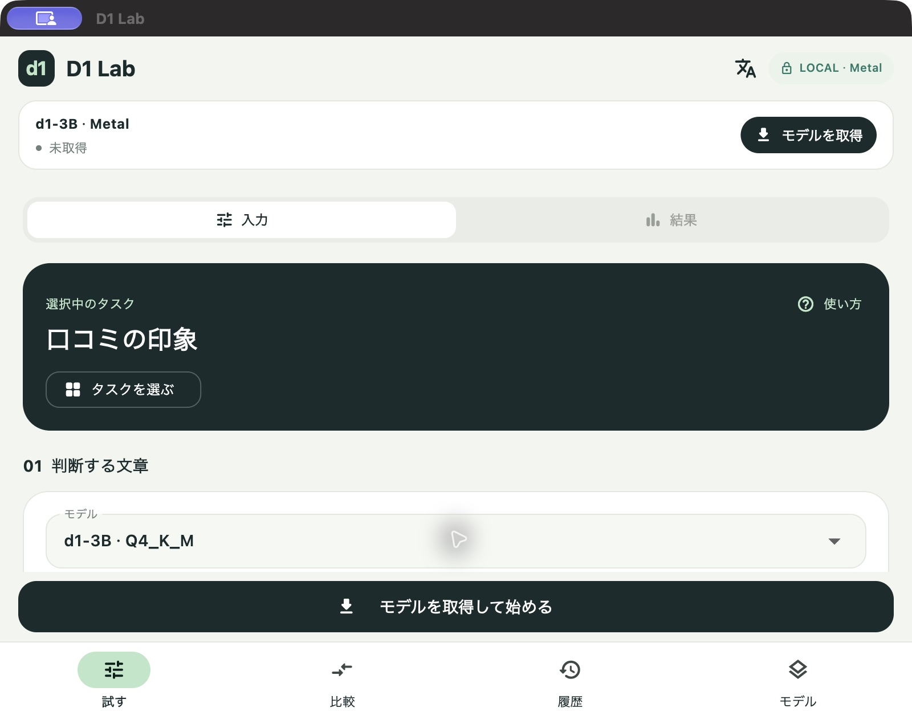
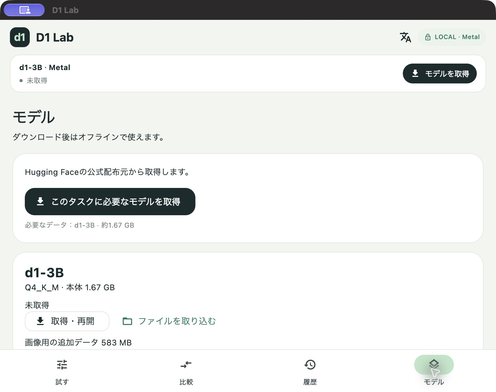

# 最初の判定を試す

[English](quickstart.en.md) · [ビルド手順](building.md) · [詳しい使い方](../README.md)

画面例はMac版です。iPhoneでも同じ順番で試せます。

[約28秒のiPhone操作動画](videos/d1-lab-quick-tour-ja.mp4)でも、タスク一覧や判定結果・速度表示を確認できます。動画は日本語画面で、モデルを準備済みです。

## 1. タスクを選ぶ

「試す」→「タスクを選ぶ」→「日本語」→「口コミの印象」を選びます。判断する文章と、指示・候補が自動で入ります。最初は書き換えずに試してください。

## 2. モデルを取得する

「モデルを取得して始める」→「このタスクに必要なモデルを取得」を押します。文章のサンプルならd1-3B本体の約1.67 GBを取得します。通信と十分な空き容量が必要です。

## 3. 判定して、文章を変える

取得が終わったら「試す」に戻り、「判定を実行する」を押します。選ばれた答えと、候補ごとの確率を確認してください。次に文章を「料理が冷たく、長く待たされた」に変えて再実行し、結果を比べます。

速度を見るときはTotalとDecisionを確認します。事前に「モデルを準備」を押すと、読み込み時間を判定の前に済ませられます。繰り返し実行するときは、読み込み済みモデルを再利用します。Prefill tok/sは入力処理の速度で、撮影・録音やモデルの読み込みは含みません。

## 次に試す

- 写真：「画像」→「写真の主な色」を選び、カメラ撮影または写真を選択して実行します。
- 録音：「音声」→「声で操作を選ぶ」を選び、録音して実行します。モデルはomniです。最初は英語で「Play music」「Stop the music」などを試せます。答えの正しさは実際に確認してください。
- 自分のタスク：文章・指示・候補を変更し、タスク名を入力して保存します。「登録先」は自動選択のままでも使えます。

写真・録音では必要な追加データも取得します。「補足」は空のままで構いません。文章・写真・録音はモデル取得後にオフラインで判定できます。

## 保存したものを削除する

「モデル」→「保存データ」で、使っていない素材だけを整理するか、履歴・写真・録音を一括削除できます。モデルファイルはモデル画面、自分のタスクはタスク一覧から削除します。[プライバシーポリシー](privacy.md)もアプリ内から読めます。
